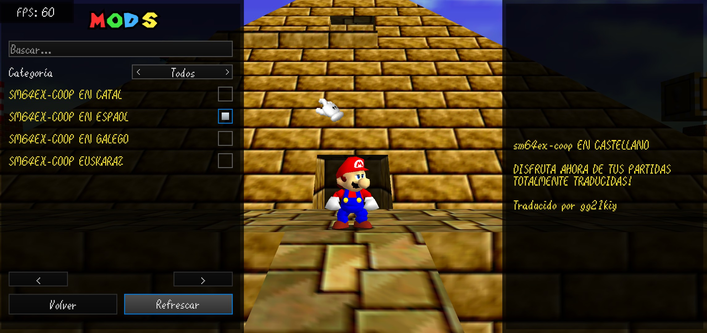
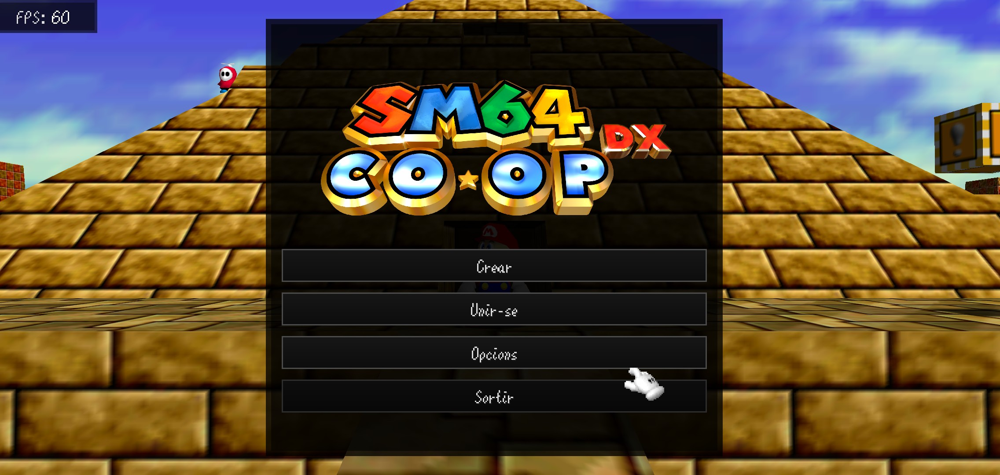
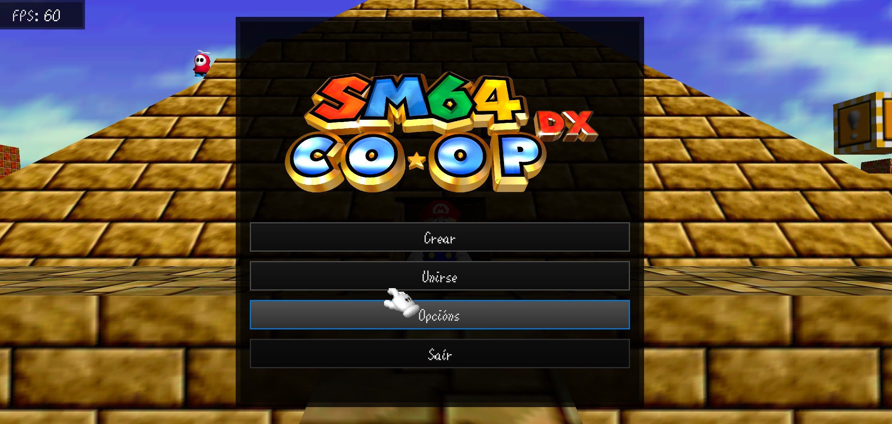
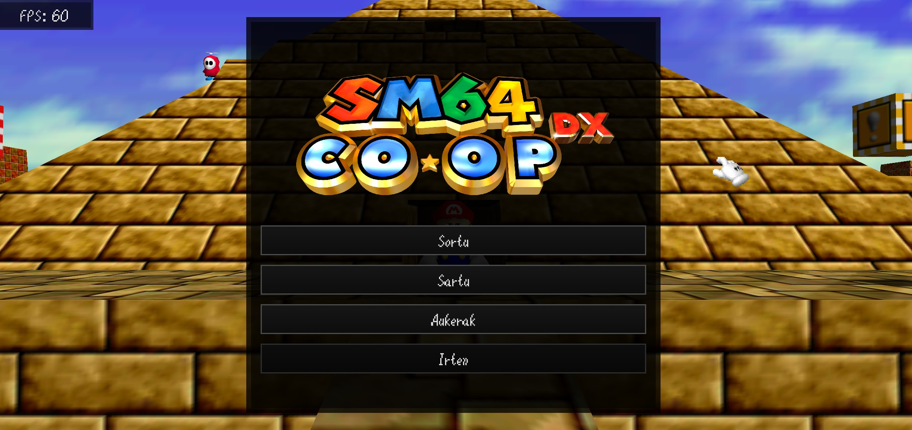
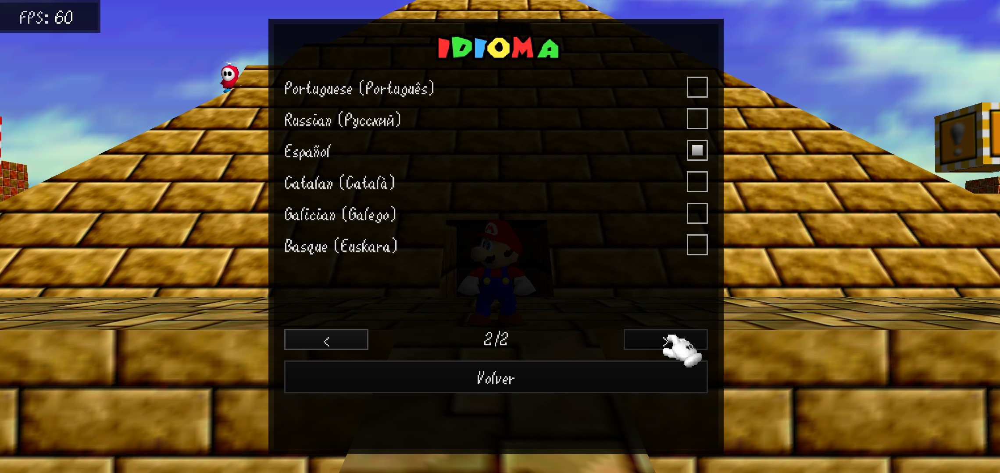

<h1>SM64Coop ES-CA-GL-EU</h1>
<h3>Pack de Traducións para SM64CoopDX / sm64ex-coop</h3>

  
  
  

  <b>README dispoñible en:</b> 
  <a href="README.md">🇪🇸 Español</a> • 
  <a href="README-CAT.md">🟡 Català</a> • 
  <a href="README-GLG.md">🔵 Galego</a> • 
  <a href="README-EUS.md">🟢 Euskara</a>

  <em>Tradución integral para Super Mario 64 CoopDX: menús da interface, nomes de niveis e diálogos en Español, Catalán, Galego e Éuscaro.</em>

  <a href="#-idiomas-dispo%C3%B1ibles">🌐 Idiomas</a> • 
  <a href="https://github.com/gg21kiy/SM64Coop-ES-CA-GL-EU/releases/latest">📥 Descargar</a>

---

## 📸 Capturas de Pantalla

  <table>
    <tr>
      <td align="center"><b>Català</b></td>
      <td align="center"><b>Galego</b></td>
    </tr>
    <tr>
      <td></td>
      <td></td>
    </tr>
    <tr>
      <td align="center"><b>Euskara</b></td>
      <td align="center"><b>Selector de Idioma</b></td>
    </tr>
    <tr>
      <td></td>
      <td></td>
    </tr>
  </table>

---

## 🌟 Características
* **Tradución integral:** Inclúe textos dos menús e interface (`lang/`), nomes de niveis (`courses.lua`) e todos os diálogos do xogo (`dialogs.lua`).
* **Multilingüe peninsular:** Soporte completo en 4 linguas: Español, Catalán, Galego e Éuscaro.
* **Modular:** Posibilidade de activar o idioma dos menús e os textos do xogo por separado.
* **Compatibilidade total:** Compatible coas versións modernas de **SM64CoopDX** e **sm64ex-coop**.

---

## 🌐 Idiomas Dispoñibles

| Idioma | Ficheiro de Interface (`lang/`) | Mod de Diálogos e Niveis (`mods/`) |
| :--- | :--- | :--- |
| **Español** | `Spanish.ini` | `SM64EX-COOP EN ESPAÑOL` |
| **Català** | `Catalan.ini` | `SM64EX-COOP EN CATAL` |
| **Galego** | `Galician.ini` | `SM64EX-COOP EN GALEGO` |
| **Euskara** | `Basque.ini` | `SM64EX-COOP EUSKARAZ` |

---

## 🕹️ Instrucións de Uso
1. **Para os menús e a interface:**
   > Opcións ➔ Idioma ➔ Selecciona `Español`, `Catalan (Català)`, `Galician (Galego)` ou `Basque (Euskara)`.
2. **Para os textos e diálogos dentro do xogo:**
   > Menú de Mods ➔ Marca a caixa do mod correspondente ao teu idioma.

---

## 📦 Instalación
1. Vai á sección de **[Releases](https://github.com/gg21kiy/SM64Coop-ES-CA-GL-EU/releases/latest)** e descarga o ficheiro `.zip` da última versión.
2. Descomprime o ficheiro descargado.
3. Copia o contido dentro do cartafol principal do teu xogo:
   * Coloca os ficheiros `.ini` dentro do directorio `lang/`.
   * Coloca os cartafoles de tradución dentro do directorio `mods/`.
4. Abre o xogo e selecciona as túas preferencias de idioma.

---

### 🗑️ Desinstalación
* Para retirar unha tradución, simplemente borra o ficheiro `.ini` correspondente no cartafol `lang/` e o cartafol asociado dentro de `mods/`.

---

## 🤝 Créditos e Agradecementos
* Desenvolvido e traducido por **[@gg21kiy](https://github.com/gg21kiy)**.
* Baseado na plataforma base de **[sm64coopdx / sm64ex-coop](https://github.com/coop-deluxe/sm64coopdx)**.
